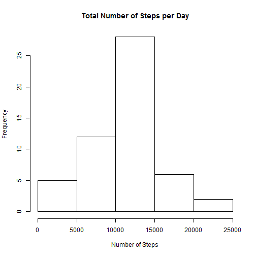
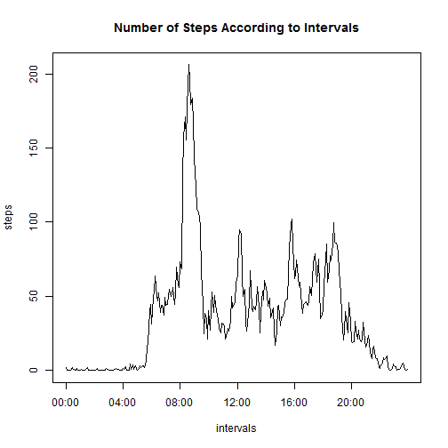
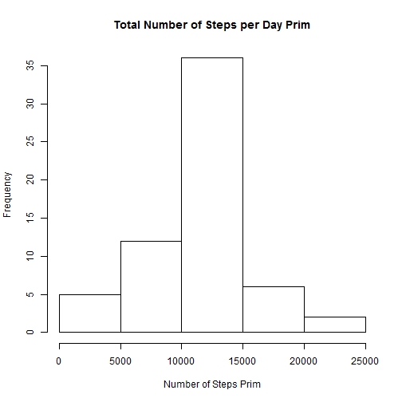
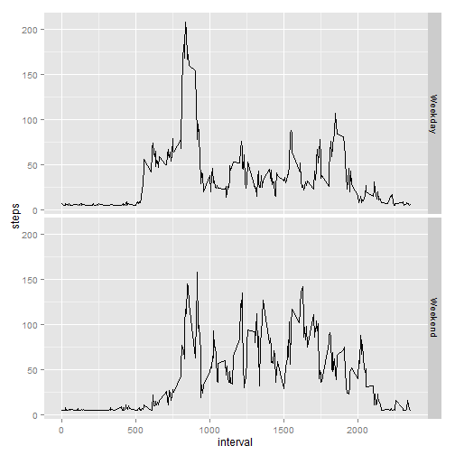

## Loading and preprocessing the data

Here we simply load the data:


```r
MyData <- read.csv("activity.csv", na.strings = "NA")
```

## What is mean total number of steps taken per day?

For this part of the assignment, you can ignore the missing values in the dataset.


**1. Calculate the total number of steps taken per day**

First we eliminate NAs: 


```r
MyDataComplete <- na.omit(MyData)
```

Then we aggregate the data: 


```r
aggData <- aggregate(steps ~date, data = MyDataComplete, FUN = "sum")

aggData
```

```
##          date steps
## 1  2012-10-02   126
## 2  2012-10-03 11352
## 3  2012-10-04 12116
## 4  2012-10-05 13294
## 5  2012-10-06 15420
## 6  2012-10-07 11015
## 7  2012-10-09 12811
## 8  2012-10-10  9900
## 9  2012-10-11 10304
## 10 2012-10-12 17382
## 11 2012-10-13 12426
## 12 2012-10-14 15098
## 13 2012-10-15 10139
## 14 2012-10-16 15084
## 15 2012-10-17 13452
## 16 2012-10-18 10056
## 17 2012-10-19 11829
## 18 2012-10-20 10395
## 19 2012-10-21  8821
## 20 2012-10-22 13460
## 21 2012-10-23  8918
## 22 2012-10-24  8355
## 23 2012-10-25  2492
## 24 2012-10-26  6778
## 25 2012-10-27 10119
## 26 2012-10-28 11458
## 27 2012-10-29  5018
## 28 2012-10-30  9819
## 29 2012-10-31 15414
## 30 2012-11-02 10600
## 31 2012-11-03 10571
## 32 2012-11-05 10439
## 33 2012-11-06  8334
## 34 2012-11-07 12883
## 35 2012-11-08  3219
## 36 2012-11-11 12608
## 37 2012-11-12 10765
## 38 2012-11-13  7336
## 39 2012-11-15    41
## 40 2012-11-16  5441
## 41 2012-11-17 14339
## 42 2012-11-18 15110
## 43 2012-11-19  8841
## 44 2012-11-20  4472
## 45 2012-11-21 12787
## 46 2012-11-22 20427
## 47 2012-11-23 21194
## 48 2012-11-24 14478
## 49 2012-11-25 11834
## 50 2012-11-26 11162
## 51 2012-11-27 13646
## 52 2012-11-28 10183
## 53 2012-11-29  7047
```


**2. Make a histogram of the total number of steps taken each day**


```r
Plot1 <- hist(aggData$steps, main = "Total Number of Steps per Day", 
         xlab = "Number of Steps")
```

 

**3. Calculate and report the mean and median of the total number of steps taken per day**


```r
Mean_steps <- mean(aggData$steps)
Mean_steps
```

```
## [1] 10766.19
```

```r
Median_steps <- median(aggData$steps)
Median_steps
```

```
## [1] 10765
```


## What is the average daily activity pattern?

**1. Make a time series plot (i.e. type = "l") of the 5-minute interval (x-axis) and the average number of steps taken, averaged across all days (y-axis)**

First we aggregate the data:


```r
aggData2 <- aggregate(steps~interval, data = MyData, FUN = "mean")
```

Next we create names to use later as labels for the plot


```r
start <- as.POSIXct(x = "00:00", format = "%H:%M")

time_seq <- seq(from = start, by = "5 mins", length.out = 288)


time_seq <- format(time_seq, "%H:%M")

aggData2$var_names <- time_seq
```

Then we create the plot


```r
Plot2 <- with(aggData2, plot(steps, type="l", xaxt = "n", xlab= "intervals",
              main = "Number of Steps According to Intervals"))

axis(side=1, at = seq(1, 288, 48), 
     labels = aggData2$var_names[c(1, 49, 97, 145, 193, 241)])
```

 

**2. Which 5-minute interval, on average across all the days in the dataset, contains the maximum number of steps?**


```r
max_steps <- aggData2[aggData2$steps == max(aggData2$steps),]
max_steps$var_names
```

```
## [1] "08:35"
```


## Imputing missing values

**1. Calculate and report the total number of missing values in the dataset (i.e. the total number of rows with NAs)**


```r
lack <- is.na(MyData)
Missing_Number <- nrow(MyData[lack,])
Missing_Number
```

```
## [1] 2304
```


**2. Devise a strategy for filling in all of the missing values in the dataset. The strategy does not need to be sophisticated. For example, you could use the mean/median for that day, or the mean for that 5-minute interval, etc.**

**Create a new dataset that is equal to the original dataset but with the missing data filled in.**


First we check in which columns there are missing data:


```r
a <- sum(complete.cases(MyData$date))
a == nrow(MyData)
```

```
## [1] TRUE
```

```r
b <- sum(complete.cases(MyData$interval))
b == nrow(MyData)
```

```
## [1] TRUE
```

```r
c <- sum(complete.cases(MyData$steps))
c == nrow(MyData)
```

```
## [1] FALSE
```

Next we calculate the overall mean out of the existing data:


```r
overall_mean <- mean(MyDataComplete$steps)
```

Then we create a new dataset with the NAs replaced by the newly calculated mean:


```r
MyData2 <- MyData

MyData2$steps[which(is.na(MyData2$steps))] <- overall_mean
```


**3. Make a histogram of the total number of steps taken each day and Calculate and report the mean and median total number of steps taken per day. Do these values differ from the estimates from the first part of the assignment? What is the impact of imputing missing data on the estimates of the total daily number of steps?**

First we aggregate the data:


```r
aggDataPrim <- aggregate(steps ~date, data = MyData2, FUN = "sum")
```

Then we create the plot:


```r
Plot3 <- hist(aggDataPrim$steps, main = "Total Number of Steps per Day Prim", 
              xlab = "Number of Steps Prim")
```

 

Finally we calculate the mean and the median:


```r
Mean_steps_prim <- mean(aggDataPrim$steps)
Mean_steps_prim
```

```
## [1] 10766.19
```

```r
Median_steps_prim <- median(aggDataPrim$steps)
Median_steps_prim
```

```
## [1] 10766.19
```

As we can see, the changes are minor or nonexistent. In the case of the mean we do not observe any changes which is logical given that we added only values equal to the previous mean. In the case of the median there is a slight difference. It was **10765** in the dataset without NAs and **10766.19** in the dataset with the replacement for NAs. This also is not very surprising given that the value of mean was added multiple times to the new dataset.

The overall impact is that one value accounts for the whole increase which can be clearly seen on the histogram. The distribution becomes more center-oriented.  


## Are there differences in activity patterns between weekdays and weekends?


**1. Create a new factor variable in the dataset with two levels – “weekday” and “weekend” indicating whether a given date is a weekday or weekend day.**

First we read the *ggplot2* library:


```r
library(ggplot2)
```


Next we make sure that the weekdays will be displayed in English:


```r
Sys.setlocale("LC_TIME", "English")
```

```
## [1] "English_United States.1252"
```

Next we create a new variable "days" and we add it to the dataset. For now it contains weekdays:


```r
MyData3 <- MyData2

MyData3$date <- as.Date(MyData3$date)

MyData3$days <- weekdays(MyData3$date)
```

Then we attribute the labels "weekday" and "weekend" to the days accordingly:


```r
MyData3$days[which(MyData3$days == "Monday"|MyData3$days =="Tuesday"|
                     MyData3$days =="Wednesday"|MyData3$days =="Thursday"|
                     MyData3$days =="Friday")] <- "Weekday"

MyData3$days[which(MyData3$days != "Weekday")] <- "Weekend"
```

**2. Make a panel plot containing a time series plot (i.e. type = "l") of the 5-minute interval (x-axis) and the average number of steps taken, averaged across all weekday days or weekend days (y-axis).**

First we aggregate the data:


```r
aggData3 <- aggregate(steps~interval+days, data = MyData3, FUN = "mean")
```

Next we create the plot:


```r
Plot4 <- ggplot(aggData3, aes(interval, steps)) + geom_line()
Plot4 + facet_grid(days ~.)
```

 
